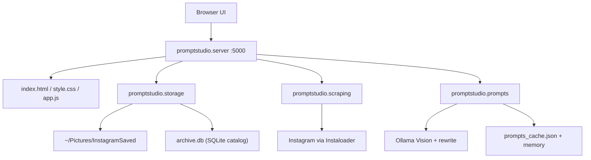

# PromptStudio Architecture Specification

PromptStudio is a local web application and AI Vision reverse-engineering engine for Instagram creator photo archives. It connects to your local image storage (`~/Pictures/InstagramSaved`), runs multimodal Ollama models to generate photorealistic image generation prompts (Stable Diffusion, Flux.1, Midjourney, ComfyUI), and provides photo management plus Instagram sync tools.

---

## 1. System Components

Package layout lives under `promptstudio/` with thin entrypoints `server.py` and `prompt_engine.py`.

---

## 2. Pipeline versions

- **Ingest:** saved posts, creator feeds, following bulk (bio keyword + media filters, resume checkpoints, exponential rate-limit backoff).
- **Prompt:** two-stage (`v2-structured`) — structured vision JSON then erotic rewrite; creator style prefixes; Flux/SDXL/Pony exports.
- **Scale:** `/media/thumb/...` thumbnails; `/api/photos` pagination with infinite scroll; SQLite `archive.db` catalog + in-memory prompt/favorites caches (set `PROMPTSTUDIO_REBUILD_INDEX=1` to force reindex).

See [roadmap.md](roadmap.md), [api.md](api.md), [instagram_downloader.md](instagram_downloader.md).
