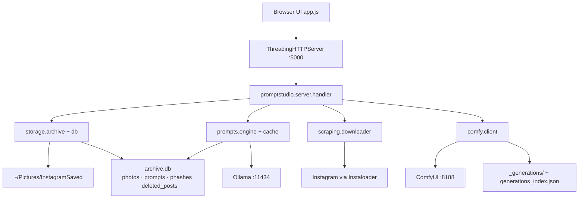

# PromptStudio Architecture

Dense overview. Prefer [context.md](context.md) for agent work; this page is the component diagram + flow.

---

## Components



Entrypoints: `server.py`, `prompt_engine.py` (shims). Logic: `promptstudio/`.

---

## Request flow (gallery)

1. Server start → `ArchiveStore.ensure_ready()` indexes disk into SQLite (unless already current; force with `PROMPTSTUDIO_REBUILD_INDEX=1`).
2. `GET /api/photos` → SQL filter/sort/page → annotate prompt flags + favorites → JSON (no `full_path`).
3. Grid uses `/media/thumb/...` (Pillow/OpenCV JPEG under `_thumbs/`); lightbox uses `/media/...`.
4. `GET /api/prompt?path=` → cache hit or Ollama two-stage pipeline → write cache → return exports + tags.

## Prompt pipeline

```
image → base64 → Ollama vision JSON (STRUCTURED_FIELDS)
      → rewrite model (+ creator style_prefix)
      → positive/negative + visual_tags + exports{flux,sdxl,pony}
      → optional Mode E strip for Comfy IPAdapter
```

Engine id: `Ollama ({MODEL_NAME}) v2-structured`. Stale if engine/pipeline mismatch.

## Sync pipeline

```
Instaloader session → download to <creator>/
  → *.meta.json (post_id, shortcode, …)
  → skip if identity already in archive.db
  → catch-up streak stop; following queue + daily budget
  → rate-limit exponential backoff → hard abort
```

Background: one `SyncManager` job at a time (saved / creator / following /
**creator_queue** drain); `CreatorScrapeQueue` persists multi-handle FIFO and
never starts a second IG session. One `BatchPromptManager` / `ComfyJobManager`
similarly.

Cross-job exclusion is a **lease**, not pairwise `is_running()` checks
(`promptstudio/jobs.py`). Three exclusive resources:

| Resource | Held by |
|----------|---------|
| `ollama` | `BatchPromptManager` |
| `instagram` | `SyncManager` (covers the creator-queue drain) |
| `comfy` | `ComfyJobManager` — declared, *not* exclusive with `ollama` |

All of a job's resources are acquired under one lock, so a job either holds
everything it needs or nothing. Two requests arriving together can no longer
both observe "free". Current holders: `GET /api/health` → `leases`.

Every run is journalled to `<archive>/_journal/<kind>.jsonl` (append-only,
rotated) — `GET /api/journal?kind=sync`. Live job status is overwritten by
the next run, so history has to live somewhere else.

## Module responsibilities

| Package | Responsibility |
|---------|----------------|
| `config` | Paths, env, pacing, models — single source of truth |
| `logging_setup` | Lazy `logging` config; handlers on the `promptstudio` logger only |
| `jobs` | Exclusive resource leases across background jobs |
| `server` | HTTP routing, CORS, multipart, static files from repo root |
| `storage` | Disk archive + SQLite + thumbs + meta + favorites |
| `storage.atomic` | `atomic_write_json` — every derived-state file goes through it |
| `storage.journal` | Append-only JSONL run history per job kind |
| `storage.dedupe` | Perceptual hashing + near-duplicate grouping |
| `prompts` | Vision, cache, batch, styles, Mode E |
| `scraping` | IG session, download, filters, queue, organize |
| `comfy` | Queue jobs, upload ref image, poll history, save gens |

## Scale notes

- Gallery never full-scans disk per request (SQLite, WAL, `busy_timeout=5000`).
- **Prompts live in the `prompts` table**, not `prompts_cache.json`. That file is
  imported once and then left on disk as a rollback snapshot — it stops being
  updated. One row upsert per save instead of rewriting ~4400 entries (7x).
- Favorites remain a process-local write-through JSON cache.
- Indexing reads each `*.meta.json` **once** (`read_sidecar`); four fields used
  to load it independently, which was 4x the file opens per photo.
- FTS5 over prompt text exists and is maintained, but search defaults to the
  LIKE scan — measured faster for common terms at current archive size
  (`PROMPTSTUDIO_FTS_SEARCH=1` to flip).
- Threaded server keeps UI responsive during sync/batch/Comfy.
- Thumbnails and pagination (`offset`/`limit`, max `PROMPTSTUDIO_PHOTO_PAGE` default 300).

See [roadmap.md](roadmap.md) for completed phases; [api.md](api.md) for contracts.
