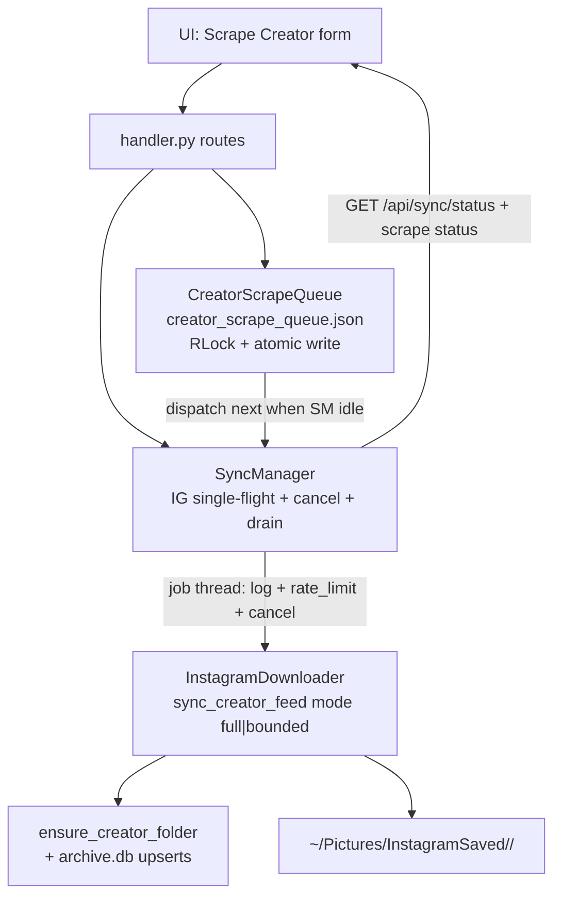

# Serial Creator Full-Scrape Job Queue

| Field | Value |
|-------|--------|
| **Document** | Serial Creator Full-Scrape Job Queue (PromptStudio) |
| **Author** | — |
| **Date** | 2026-08-08 |
| **Status** | Draft (rev 2 — review addressed) |
| **Workspace** | PromptStudio |
| **Audience** | Senior engineers familiar with PromptStudio scraping stack |

---

## Overview

PromptStudio can already sync a single creator feed (`POST /api/sync/creator` → `InstagramDownloader.sync_creator_feed`) under a one-at-a-time `SyncManager`. That path is **single-shot**: if a job is running, the next start fails with 409; there is no multi-handle queue; “scrape everything” is not a first-class mode (`max_posts` defaults to 50); and “create folder + start scrape” is two conceptual steps.

This design introduces a **user-facing creator scrape job queue**: type a handle → enqueue → system ensures the creator folder → scrapes the feed (**true full archive** by default, or bounded) → processes multiple enqueued creators **strictly one after another**. All Instagram network work remains globally single-flight. Implementation reuses `InstagramDownloader`, extends `SyncManager` as the IG execution mutex, and adds a small persistent queue module inspired by (but stricter than) `FollowingQueue` JSON persistence and `ClassifyJobManager` cancel patterns—not a second IG client.

---

## Background & Motivation

### Current state (grounded in code)

| Piece | Role today |
|-------|------------|
| [`promptstudio/scraping/sync_manager.py`](../../promptstudio/scraping/sync_manager.py) `SyncManager` | Singleton; `start_job(job_type, fn)` returns `False` if `running`; persists `sync_status.json`; no pending queue; **no cancel**; stuck `running: true` survives process death |
| [`promptstudio/scraping/downloader.py`](../../promptstudio/scraping/downloader.py) `InstagramDownloader.sync_creator_feed` | Two-phase: collect up to `max_posts * POST_SCAN_FACTOR` candidates, optional rank, download top `max_posts`; catch-up stop after `CATCH_UP_STREAK` consecutive complete posts; blocking `time.sleep` for delays/backoff |
| [`promptstudio/scraping/queue.py`](../../promptstudio/scraping/queue.py) `FollowingQueue` | Multi-day bulk for **following list** with daily budget; **not** a singleton; `save()` is plain `json.dump` with **no** lock and **no** atomic replace—pattern to improve on, not copy blindly |
| [`promptstudio/scraping/classify_job.py`](../../promptstudio/scraping/classify_job.py) `ClassifyJobManager` | Cooperative cancel Event, busy status dict, mutual exclusion with batch prompts |
| [`promptstudio/server/handler.py`](../../promptstudio/server/handler.py) | `POST /api/creator/create`, `POST /api/sync/creator\|saved\|following`, `GET /api/sync/status`; no `/api/sync/cancel` |
| [`promptstudio/storage/archive.py`](../../promptstudio/storage/archive.py) `ArchiveStore.create_creator` | Sanitizes handle, `os.makedirs`; does **not** return created-vs-existed; does **not** reject `EXCLUDED_FOLDERS` |
| Frontend [`app.js`](../../app.js) | Sync modal: handle + hard-coded `max_posts: 50`; polls `/api/sync/status` |

### Pain points

1. **No multi-creator queue.** Extra starts rejected with `busy` / 409.
2. **Full archive is awkward.** Rank + scan truncation; catch-up alone cannot express “download all missing posts.”
3. **Non-atomic UX.** Create folder vs start sync are separate.
4. **Ambiguous IG mutex** for a new queue vs saved/following/creator and non-IG jobs.
5. **No cancel on IG jobs**; long sleeps ignore cancel.

### Product intent

```
User types @handle → enqueue job → ensure folder → serial full/bounded scrape
  → progress visible → media in archive → gallery refresh
```

Safe for IG: **one Instaloader session / one network scrape at a time globally**.

---

## Goals & Non-Goals

### Goals

1. **Enqueue** creator scrape jobs by handle (FIFO by default; optional priority).
2. **Atomic start:** ensure creator folder + enqueue scrape in one user action / one primary API.
3. **Serial execution:** never run two Instagram network jobs concurrently; queue drains one job at a time.
4. **True full-scrape mode** as first-class: stream the feed, download every missing/incomplete post, **catch-up off by default** (plus bounded `max_posts` for lighter pulls).
5. **Persist queue** across server restarts (JSON under archive).
6. **API + UI** for enqueue, status (current + depth), cancel current/pending, pause/resume.
7. **Reuse** `InstagramDownloader` session / pacing / abort logic.
8. Clear **mutual exclusion** with `/api/sync/*` (including **pending** queue fairness) and non-IG jobs.

### Non-Goals

- Replacing or merging `FollowingQueue` multi-day bulk.
- Parallel Instagram scrapes, multi-session Instaloader, or proxy rotation.
- Automatic unfollow / non-person filter UX.
- Distributed workers, Redis, Celery.
- Deleting media without confirm.
- Guaranteeing complete history when IG rate-limits or private profiles block access.
- Updating `FollowingQueue` marks when a creator-queue job finishes (operators can still use following bulk separately).
- Migrating `scripts/sync_all_local_creators.py` onto the new queue (CLI remains independent; optional later).

---

## Proposed Design

### High-level architecture



### Core decision: separate queue module + SyncManager as IG mutex

| Component | Responsibility |
|-----------|----------------|
| **`CreatorScrapeQueue`** (`promptstudio/scraping/creator_queue.py`) | Singleton; `threading.RLock`; atomic JSON save; enqueue/dedupe/cancel/pause; **no** Instaloader |
| **`SyncManager`** (extend) | Global single-flight for `saved` / `creator` / `following` / `creator_queue`; cooperative cancel; finish-hook drain; restart reset |
| **`InstagramDownloader`** (extend) | `mode="full"|"bounded"`; streaming full path; interruptible sleeps; `should_cancel` on instance |
| **`ensure_creator_folder`** (new helper, archive or creator_queue) | Validate + makedirs + `{name, created: bool}` |

**Why not only extend `FollowingQueue`?** Different lifecycle (ad-hoc handles vs multi-day following budget). Reuse ideas (JSON path under archive, username normalize, status marks)—**not** the file, schema, or (nonexistent) locking.

**Why not fold the pending list only into `SyncManager`?** See Alternatives #5: bloated module, harder unit tests. Separate module preferred.

**Why not a runner outside SyncManager?** Dual Instaloader risk. All IG network entry points go through `SyncManager.start_job`.

### Job model

#### Job record (persisted)

```json
{
  "id": "csq_20260808T143012Z_a1b2",
  "username": "roxeuoon",
  "mode": "full",
  "deep": true,
  "max_posts": null,
  "include_videos": true,
  "priority": 0,
  "status": "pending",
  "created_at": "2026-08-08T14:30:12+00:00",
  "started_at": null,
  "finished_at": null,
  "folder_created": false,
  "folder_name": "roxeuoon",
  "error": "",
  "result": null,
  "stop_reason": null,
  "cancel_requested": false
}
```

| Field | Notes |
|-------|--------|
| `id` | `csq_` + UTC stamp + short random |
| `username` | Strip `@`, trim; enqueue validation via `ensure_creator_folder` |
| `folder_name` | Sanitized name returned by ensure helper (may differ slightly from raw input) |
| `mode` | `"full"` \| `"bounded"` |
| `deep` | When `true` (default for `mode=full`): **disable catch-up streak**. When `false`: catch-up on (resume-friendly “recent walk”). Bounded mode always behaves as today (catch-up on). |
| `max_posts` | Required for bounded (≥1, default `DEFAULT_MAX_POSTS_PER_CREATOR`). For full: ignored except as optional per-job ceiling override; else `FULL_SCRAPE_MAX_POSTS` |
| `include_videos` | Default `INCLUDE_VIDEOS_DEFAULT` |
| `priority` | Higher first; ties by `created_at` ASC (FIFO). Default `0` |
| `status` | `pending` → `running` → terminal: `done` \| `error` \| `cancelled` only. **`skipped` is not used in V1** (removed from enum) |
| `result` | `SyncResult.to_dict()` including `stop_reason` |
| `stop_reason` | Copied from result for UI without digging into result blob |
| `folder_created` | From `ensure_creator_folder` |

#### Dedupe key

`username.lstrip("@").strip().lower()` for pending/running uniqueness. Folder name preserves sanitized case from ensure helper.

#### File layout

```
PROMPTSTUDIO_ARCHIVE/
  creator_scrape_queue.json   # NEW
  sync_status.json
  sync_state.json
  following_queue.json
  <creator>/
```

#### Config (`promptstudio/config.py`)

```python
CREATOR_SCRAPE_QUEUE_FILE = os.path.join(SAVED_DIR, "creator_scrape_queue.json")
FULL_SCRAPE_MAX_POSTS = int(os.environ.get("IG_FULL_SCRAPE_MAX_POSTS", "5000"))  # 0 = unlimited
CREATOR_SCRAPE_HISTORY_MAX = int(os.environ.get("IG_SCRAPE_HISTORY_MAX", "50"))
CREATOR_SCRAPE_MAX_PENDING = int(os.environ.get("IG_SCRAPE_MAX_PENDING", "50"))  # hard cap
# Feature flag: when false, /api/scrape/* returns 404; drain is no-op
CREATOR_SCRAPE_QUEUE_ENABLED = os.environ.get("IG_CREATOR_SCRAPE_QUEUE", "1").lower() in (
    "1", "true", "yes",
)
# After server start recovery, auto-start next pending job (short delay)
AUTO_DRAIN_ON_START = os.environ.get("IG_AUTO_DRAIN_ON_START", "1").lower() in (
    "1", "true", "yes",
)
AUTO_DRAIN_ON_START_DELAY_SEC = float(os.environ.get("IG_AUTO_DRAIN_DELAY_SEC", "2"))
```

#### Queue file schema

```json
{
  "version": 1,
  "paused": false,
  "pause_reason": "",
  "paused_at": null,
  "day_key": "2026-08-08",
  "stats": {
    "completed_today": 0,
    "downloaded_today": 0,
    "errors_today": 0
  },
  "jobs": [],
  "history": []
}
```

- `paused: true` after rate-limit/abuse hard abort (or user pause); no auto-drain until resume.
- `stats` roll on calendar day like FollowingQueue’s day key (for ban hygiene visibility).
- Soft rate-limit hits do **not** set `paused` (only update SyncManager progress via existing `on_rate_limit`).

### CreatorScrapeQueue concurrency & persistence (Issue 6)

```python
class CreatorScrapeQueue:
    _instance = None
    _init_lock = threading.Lock()

    def __init__(self, path=CREATOR_SCRAPE_QUEUE_FILE):
        self.path = path
        self._lock = threading.RLock()  # re-entrant: mark_running inside enqueue paths OK
        self._data = self._load()
        self._recover_interrupted_jobs()  # re-pend status==running
        self._roll_day_if_needed()

    @classmethod
    def get(cls) -> "CreatorScrapeQueue":
        ...

    def _save(self) -> None:
        """Caller MUST hold self._lock. Atomic replace — improve on FollowingQueue.save."""
        import tempfile
        dir_name = os.path.dirname(self.path) or "."
        os.makedirs(dir_name, exist_ok=True)
        fd, tmp = tempfile.mkstemp(prefix=".csq_", suffix=".tmp", dir=dir_name)
        try:
            with os.fdopen(fd, "w", encoding="utf-8") as f:
                json.dump(self._data, f, indent=2, ensure_ascii=False)
                f.flush()
                os.fsync(f.fileno())
            os.replace(tmp, self.path)  # atomic on Windows for same volume
        except Exception:
            try:
                os.unlink(tmp)
            except OSError:
                pass
            raise

    # All public methods: with self._lock: ... mutate ... self._save()
    # Snapshot getters return deep-copied dicts/lists so callers never share mutable state
```

**Note:** `FollowingQueue` today is per-`InstagramDownloader` instance, unlocked, non-atomic. **Out of scope** to fix; implementers must **not** copy that pattern for `CreatorScrapeQueue`.

### ensure_creator_folder (Issue 8)

New helper (prefer `promptstudio/storage/archive.py` next to `create_creator`, or thin wrapper used only by scrape enqueue):

```python
def ensure_creator_folder(name: str, base_dir: str = SAVED_DIR) -> dict:
    """
    Returns {"name": str, "created": bool, "path": str}.
    Raises ValueError for empty/invalid/excluded names.
    """
    raw = (name or "").strip().lstrip("@")
    clean = re.sub(r"[^a-zA-Z0-9_\.]", "", raw)
    if not clean:
        raise ValueError("Invalid creator handle name")
    if clean in EXCLUDED_FOLDERS or clean.startswith("_") or clean.startswith("."):
        raise ValueError(f"Reserved or excluded creator name: {clean}")
    path = os.path.join(os.path.expanduser(base_dir), clean)
    existed = os.path.isdir(path)
    os.makedirs(path, exist_ok=True)
    return {"name": clean, "created": not existed, "path": path}
```

`ArchiveStore.create_creator` can delegate to this helper (return `name` only for backward compat) or remain as-is with enqueue using the new helper exclusively.

**Instaloader casing:** Media is written under Instaloader’s `post.owner_username` / profile username (existing `downloader` behavior: `save_dir/{owner_username}`). Enqueue folder may differ in case from IG’s canonical username. **At job start**, after `Profile.from_username`, if `profile.username` sanitizes to a different folder string than `job["folder_name"]`, log a warning and prefer **profile.username** for subsequent downloads (existing path); do not migrate files in V1. Dedupe key remains lowercased input handle.

### Full-scrape semantics (`mode="full"`) — Issues 1 & 2

#### Catch-up / deep decision (Key Decision #13)

| Mode | `deep` default | Catch-up (`CATCH_UP_STREAK`) | Ranking | Algorithm |
|------|----------------|------------------------------|---------|-----------|
| `bounded` | n/a (`deep` ignored) | **On** (today) | On if `POST_RANK_ENABLED` | Existing two-phase collect → sort → download top N |
| `full` | **`deep=true`** | **Off** when `deep=true` | **Forced off** | **Streaming** download loop (below) |
| `full` | `deep=false` (explicit resume) | **On** | Forced off | Streaming, but stop after catch-up streak |

**Product claim:** Default enqueue `mode=full, deep=true` means **true full archive** (walk until end of feed or download ceiling), including gap-filled glam top-N folders. Users who only want “catch up recent” pass `deep=false` or use bounded mode.

#### Ceiling counts **successful new downloads only**

`FULL_SCRAPE_MAX_POSTS` (or per-job override) stops when:

```text
result.downloaded >= ceiling
```

- **Does not** count: already-complete skips, video skips, failed downloads, “scanned only.”
- **Does count:** each post that results in at least one new media file download (`result.downloaded` increments as today in `_download_post`).
- Incomplete carousels: downloading remaining slides increments `downloaded` per existing logic; one incomplete post may add multiple files but typically one logical post fetch—**ceiling uses `result.downloaded` as implemented today** (file-oriented). Document: ceiling is “new media units downloaded,” not distinct shortcodes. If implementers need shortcode ceiling later, add `downloaded_posts` counter—**V1 uses existing `downloaded` int**.

#### `stop_reason` on `SyncResult` (extend dataclass)

```python
# Added field
stop_reason: str = ""  # end_of_feed | catch_up | ceiling | abort | cancel | not_found | private | error | nothing_new
```

#### Full mode streaming algorithm (authoritative)

Bounded path stays **unchanged** (explicit `if mode == "bounded":` existing body).

```python
def sync_creator_feed(
    self,
    username: str,
    max_posts: int = DEFAULT_MAX_POSTS_PER_CREATOR,
    include_videos: bool = INCLUDE_VIDEOS_DEFAULT,
    *,
    mode: str = "bounded",  # "bounded" | "full"
    deep: bool = True,      # only meaningful for mode=="full"; default True
) -> SyncResult:
    """should_cancel is self.should_cancel (set in __init__), not a per-call kwarg."""
    result = SyncResult(job_type="creator")
    username = username.lstrip("@").strip()
    ...
    # load session, Profile.from_username — existing error paths
    # Private check (Issue 14):
    if getattr(creator_profile, "is_private", False):
        # If session cannot see posts, fail fast
        try:
            followed = creator_profile.followed_by_viewer  # may be expensive; optional
        except Exception:
            followed = None
        if followed is False or (followed is None and creator_profile.mediacount == 0):
            # Prefer: attempt one get_posts peek; if PermissionError/private-like → private
            pass
    # Concrete V1 private detection:
    # After Profile.from_username succeeds:
    if creator_profile.is_private and not creator_profile.followed_by_viewer:
        result.errors += 1
        result.stop_reason = "private"
        result.messages.append(f"@{username} is private and not followed by session user")
        return result

    if mode == "bounded":
        return self._sync_creator_feed_bounded(...)  # existing algorithm extracted

    # ---- mode == "full": STREAMING, no candidate list, no rank ----
    ceiling = max_posts if max_posts and max_posts > 0 else FULL_SCRAPE_MAX_POSTS
    if ceiling <= 0:
        ceiling = None  # unlimited
    use_catch_up = not deep  # deep=True → no catch-up
    consecutive_known = 0
    scanned = 0

    try:
        for post in creator_profile.get_posts():
            if self._aborted or self._cancel_requested():
                if not result.aborted:
                    self._trigger_abort(
                        "Cancelled by user" if self._cancel_requested() else self._abort_reason,
                        result,
                    )
                result.stop_reason = "cancel" if self._cancel_requested() else "abort"
                break

            if post.is_video and not include_videos:
                result.skipped += 1
                # video skip does not affect catch-up streak
                continue

            scanned += 1
            state = self._post_archive_state(post)

            if state == "complete":
                result.skipped += 1
                if use_catch_up:
                    consecutive_known += 1
                    if consecutive_known >= CATCH_UP_STREAK:
                        result.stop_reason = "catch_up"
                        self.log(f"Catch-up streak — stop full@{username}")
                        break
                continue

            consecutive_known = 0  # missing or incomplete resets streak
            self._download_post(post, result, username=username)
            # incomplete carousel: _download_post / archive state handles slides

            if ceiling is not None and result.downloaded >= ceiling:
                result.stop_reason = "ceiling"
                self.log(f"Full scrape ceiling {ceiling} reached @{username}")
                break

            if self._aborted:
                result.stop_reason = "cancel" if self._cancel_requested() else "abort"
                break
        else:
            # iterator exhausted without break
            if not result.stop_reason:
                result.stop_reason = "end_of_feed"
    except ProfileNotExistsException:
        ...
    except Exception as exc:
        # abuse → abort + stop_reason abort; connection → backoff (interruptible) ...
        ...

    if not result.stop_reason and not result.aborted:
        if scanned == 0 and result.downloaded == 0 and result.errors == 0:
            result.stop_reason = "nothing_new"
        elif result.downloaded == 0 and result.skipped > 0:
            result.stop_reason = "nothing_new"
        else:
            result.stop_reason = result.stop_reason or "end_of_feed"

    if not self._aborted:
        organize_root_images(...)
    return result
```

**Implementer rules:**

1. **Do not** implement full mode as `max_posts=999999` on the bounded path.
2. **Do not** allocate a giant `candidates` list in full mode.
3. **`POST_RANK_ENABLED` and `POST_SCAN_FACTOR` are irrelevant** in full mode (no branch uses them).
4. **`sync_following`** always calls bounded path (default `mode="bounded"`)—regression required in PR2.

### Serial execution & drain loop

```mermaid
sequenceDiagram
  participant U as User/UI
  participant H as handler.py
  participant Q as CreatorScrapeQueue
  participant S as SyncManager
  participant D as InstagramDownloader

  U->>H: POST /api/scrape/enqueue
  H->>Q: ensure_creator_folder + enqueue
  H->>S: try_drain_creator_queue()
  alt idle and not paused and flag on
    S->>S: start_job creator_queue
    S->>Q: mark_running
    S->>D: account cooldown if not first + sync_creator_feed
    D-->>S: SyncResult
    Note over S,Q: Drain wrapper terminal table
    S->>Q: mark terminal + maybe pause + stats
    S->>S: clear cancel; running=false
    S->>S: try_drain if not paused
  else busy or paused
    H-->>U: status queued
  end
```

#### Drain wrapper — complete terminal state machine (Issue 3)

`start_job`’s `runner` today sets `progress: "Complete"` whenever `fn` returns without raising—even if `result.aborted`. Drain logic therefore **must inspect `SyncResult` inside `fn` before return**, and/or teach `runner` to set progress from `result.aborted` (small SM improvement in PR1/PR4):

```python
# Inside SyncManager.runner after result = fn(...):
if hasattr(result, "aborted") and result.aborted:
    self._status["progress"] = f"Aborted — {getattr(result, 'abort_reason', '')}"
elif getattr(result, "stop_reason", None):
    self._status["progress"] = f"Complete ({result.stop_reason})"
else:
    self._status["progress"] = "Complete"
```

**Authoritative terminal decision table** (applied in drain `fn` after `sync_creator_feed` returns, and in `except` for unexpected exceptions):

| Condition | Detect | job status | `queue.paused` | `pause_reason` | drain next? | history |
|-----------|--------|------------|----------------|----------------|-------------|---------|
| Success (incl. `nothing_new`, `end_of_feed`, `catch_up`, `ceiling`) | `not result.aborted` and no uncaught exc; `stop_reason` not abort/cancel | **`done`** | no | — | **yes** | yes |
| Profile not found | `stop_reason=="not_found"` or messages | **`error`** | no | — | **yes** | yes |
| Private | `stop_reason=="private"` | **`error`** | no | — | **yes** | yes |
| Soft rate-limits only | `rate_limit_hits>0` but not aborted | **`done`** (if finished) | no | — | **yes** | yes |
| Hard rate-limit / abuse abort | `result.aborted` and reason contains rate-limit streak or abuse phrases | **`error`** | **yes** (persist immediately) | `result.abort_reason` | **no** | yes |
| User cancel | `result.aborted` and cancel requested / `stop_reason=="cancel"` | **`cancelled`** | no | — | **yes** (V1 per-job cancel) | yes |
| Unexpected exception in fn | `except Exception` | **`error`** | no (unless message looks like abuse—then yes) | str(exc) if pause | **yes** unless paused | yes |
| Server restart mid-job | init recovery | re-**`pending`** | unchanged | — | see AUTO_DRAIN | n/a |

**Drain `fn` pseudocode (complete):**

```python
def try_drain_creator_queue(self) -> bool:
    if not CREATOR_SCRAPE_QUEUE_ENABLED:
        return False
    q = CreatorScrapeQueue.get()
    if q.is_paused() or self.is_running():
        return False
    job = q.peek_next()
    if not job:
        return False

    def fn(log, on_rate_limit=None):
        job_id = job["id"]
        q.mark_running(job_id)
        self._set_scrape_meta(job_id, job["username"])  # status fields
        self._cancel.clear()

        # Inter-job cooldown (not before the very first job after idle gap optional):
        # If queue stats say previous job finished recently, sleep account pause with progress.
        if q.should_account_pause_before(job_id):
            self._interruptible_account_pause(log)  # shows remaining seconds

        if q.should_batch_pause():
            self._interruptible_batch_pause(log)

        ensure_creator_folder(job["username"])  # idempotent
        dl = InstagramDownloader(
            log=log,
            on_rate_limit=on_rate_limit,
            should_cancel=self.is_cancel_requested,
        )
        result = None
        try:
            result = dl.sync_creator_feed(
                job["username"],
                max_posts=job.get("max_posts") or (
                    FULL_SCRAPE_MAX_POSTS if job["mode"] == "full" else DEFAULT_MAX_POSTS_PER_CREATOR
                ),
                include_videos=job.get("include_videos", INCLUDE_VIDEOS_DEFAULT),
                mode=job["mode"],
                deep=job.get("deep", True) if job["mode"] == "full" else False,
            )
        except Exception as exc:
            q.finalize_job(
                job_id,
                status="error",
                error=str(exc),
                result=None,
                stop_reason="error",
            )
            # do not pause unless abuse-like
            if _looks_like_abuse(exc):
                q.pause(str(exc), persist=True)
            return {"aborted": True, "abort_reason": str(exc), "errors": 1}

        # --- terminal mapping (Issue 3 + Issue 9) ---
        stop = getattr(result, "stop_reason", "") or ""
        aborted = bool(result.aborted)
        user_cancel = aborted and (
            stop == "cancel" or "cancelled by user" in (result.abort_reason or "").lower()
        )
        hard_ig = aborted and not user_cancel  # rate-limit streak or abuse

        if user_cancel:
            q.finalize_job(job_id, status="cancelled", error=result.abort_reason,
                           result=result.to_dict(), stop_reason="cancel")
        elif hard_ig:
            q.finalize_job(job_id, status="error", error=result.abort_reason,
                           result=result.to_dict(), stop_reason="abort")
            q.pause(result.abort_reason or "IG abort", persist=True)  # BEFORE SM clears running
        elif stop in ("not_found", "private", "error") or (
            result.errors and result.downloaded == 0 and stop not in (
                "nothing_new", "end_of_feed", "catch_up", "ceiling"
            )
        ):
            # not_found/private already set stop_reason; finalize error, continue drain
            q.finalize_job(job_id, status="error",
                           error=(result.messages[-1] if result.messages else stop),
                           result=result.to_dict(), stop_reason=stop or "error")
        else:
            q.finalize_job(job_id, status="done", error="",
                           result=result.to_dict(), stop_reason=stop or "end_of_feed")

        q.record_stats_from_result(result)  # completed_today / downloaded_today
        return result

    ok = self.start_job("creator_queue", fn)
    return ok


# SyncManager.runner finally (after setting running=False, clear cancel_requested):
#   self._cancel.clear()
#   self._clear_scrape_meta()
#   if not CreatorScrapeQueue.get().is_paused():
#       self.try_drain_creator_queue()
```

**Pause ownership (Issue 9):** Only the **drain wrapper** calls `q.pause(...)` after inspecting `SyncResult`. Soft `on_rate_limit` only updates SyncManager counters/progress (existing). Pause is **persisted to JSON immediately** inside `q.pause` (holds RLock + `_save`) before the job fn returns so a kill mid-teardown still leaves queue paused.

**Cancel clear:** `request_cancel` sets Event; cleared at start of each job and after runner finishes (success or fail).

### SyncManager extensions

| Addition | Purpose |
|----------|---------|
| `_cancel: threading.Event` | Cooperative cancel |
| `request_cancel() -> bool` | Set if running |
| `is_cancel_requested() -> bool` | Downloader + sleeps |
| `_interruptible_sleep(seconds, log=None, label=...)` | 0.5–1s slices; check cancel + aborted |
| Status: `cancel_requested`, `scrape_job_id`, `scrape_username` | UI |
| `try_drain_creator_queue()` | Enqueue, job end, startup |
| Init recovery | Reset stuck running; coordinate with queue re-pend |
| runner progress | Honor `result.aborted` / `stop_reason` |

#### Interruptible sleeps (Issue 7) — PR1 required

Prefer **instance attribute** on `InstagramDownloader`:

```python
def __init__(..., should_cancel: Optional[Callable[[], bool]] = None):
    self.should_cancel = should_cancel or (lambda: False)

def _cancel_requested(self) -> bool:
    try:
        return bool(self.should_cancel())
    except Exception:
        return False

def _interruptible_sleep(self, seconds: float, *, what: str = "sleep") -> bool:
    """Return True if cancelled/aborted early."""
    end = time.monotonic() + max(0.0, seconds)
    while time.monotonic() < end:
        if self._aborted or self._cancel_requested():
            return True
        remaining = end - time.monotonic()
        time.sleep(min(1.0, max(0.0, remaining)))
    return False
```

Replace bodies of `_sleep_post_delay`, `_sleep_account_pause`, `_maybe_batch_pause`, and rate-limit backoff sleeps to use `_interruptible_sleep`. On early exit due to cancel, call `_trigger_abort("Cancelled by user", result)` when a `result` is in scope, or set `_aborted` so outer loops stop.

Drain inter-job cooldown uses the same helper and updates progress:

```text
Cooldown between creators — 87s remaining
```

### One-shot vs pending queue fairness (Issue 5 — Key Decision #14)

**V1 rule (strict queue priority when pending):**

If `CreatorScrapeQueue` has `pending` count > 0 **and** queue is **not** paused, then `POST /api/sync/saved|creator|following` returns **409**:

```json
{
  "status": "busy",
  "message": "Creator scrape queue has N pending — pause or empty the queue first",
  "creator_queue_depth": N
}
```

- Running queue job already blocks via `is_running()`.
- When queue is **paused** with pending jobs, one-shot **is allowed** (operator explicitly paused queue to run something else).
- When queue empty, one-shot works as today.
- UI (PR6): disable Sync modal start buttons when `creator_queue.depth > 0 && !paused`, show message from status.

This prevents overnight multi-handle queues from being starved by accidental Saved/Following clicks.

### Restart recovery order (Issue 4)

**Single init path** (call from `SyncManager.__init__` after loading status, and ensure queue `get()` uses same process—handler import order constructs `_sync = SyncManager.get()` first):

```text
1. SyncManager.__init__:
   a. Load sync_status.json
   b. If status.running == true:
        - Set running=false
        - finished_at=now
        - error = "Server restarted"
        - progress = "Interrupted by server restart"
        - Clear cancel_requested, scrape_job_id, scrape_username
        - Preserve last result/logs but prefix progress so UI is not “Complete”
        - _save_status()
   c. Register finish-hook for drain (no drain yet)

2. CreatorScrapeQueue.get() first time (from handler module import or SM init end):
   a. Load creator_scrape_queue.json under RLock
   b. Any job status==running → status=pending, error note "Interrupted by server restart",
      clear started_at; save
   c. Do NOT clear user pause flags

3. If CREATOR_SCRAPE_QUEUE_ENABLED and AUTO_DRAIN_ON_START:
   a. Start daemon timer/thread: sleep AUTO_DRAIN_ON_START_DELAY_SEC (default 2s)
   b. Call SyncManager.try_drain_creator_queue()
   c. If paused, skip (operator must resume)

4. Only after steps 1–2 may HTTP handlers enqueue or start one-shot jobs.
```

**Default `AUTO_DRAIN_ON_START=true`:** operators expect pending work to resume after server restart. Set env `IG_AUTO_DRAIN_ON_START=0` to require explicit resume/enqueue.

### Feature flag

| `IG_CREATOR_SCRAPE_QUEUE` | Behavior |
|--------------------------|----------|
| on (default) | Full scrape API + drain |
| off | `POST/GET /api/scrape/*` → **404**; `try_drain` no-op; `/api/sync/*` unchanged (no pending-queue 409 from empty/disabled queue) |

---

## API / Interface Changes

### New endpoints (flag on)

#### `POST /api/scrape/enqueue`

```json
{
  "username": "roxeuoon",
  "mode": "full",
  "deep": true,
  "max_posts": null,
  "include_videos": true,
  "priority": 0
}
```

| Field | Default |
|-------|---------|
| `username` | required |
| `mode` | `"full"` |
| `deep` | `true` if mode=full else ignored |
| `max_posts` | bounded: 50; full: null → config ceiling |
| `include_videos` | config |
| `priority` | 0 |

**Responses (all success-class idempotent cases use HTTP 200):**

| HTTP | `status` | Meaning |
|------|----------|---------|
| 200 | `started` | Enqueued + drain started this job |
| 200 | `queued` | Enqueued; waiting |
| 200 | `already_pending` | Idempotent; same handle already pending — **not an error** |
| 200 | `already_running` | Same handle running — **not an error** |
| 400 | — | Invalid name, excluded, `pending >= CREATOR_SCRAPE_MAX_PENDING` |
| 404 | — | Feature flag off |

**No 409 on enqueue while paused** — enqueue is always allowed (up to cap); drain won’t run until resume.

```json
{
  "status": "queued",
  "job": { "id": "csq_…", "username": "roxeuoon", "mode": "full", "deep": true, "status": "pending" },
  "position": 2,
  "queue_depth": 3,
  "folder": "roxeuoon",
  "folder_created": true
}
```

#### `GET /api/scrape/status`

Authoritative for queue UI. Includes `paused`, `pause_reason`, `paused_at`, `stats`, `pending`, `running_job`, `history` (tail), and embedded `sync` from SyncManager.

**Deferred:** `GET /api/scrape/queue` — use status only (Issue 13).

#### `POST /api/scrape/cancel`

```json
{ "job_id": "csq_…", "scope": "job" }
```

| scope | Behavior |
|-------|----------|
| `job` | Pending → cancelled. Running + matching id → `SyncManager.request_cancel()`. Else 404 |
| `all_pending` | Cancel all pending; running unchanged unless `cancel_running: true` |

**Removed** ambiguous `scope: current` — use `POST /api/sync/cancel` for “cancel whatever IG job is running” (including `creator_queue`).

#### `POST /api/sync/cancel` (PR1)

Cancels **any** running IG job via `SyncManager.request_cancel()`. Returns `{status: "cancelling"|"idle"}`.

#### `POST /api/scrape/pause` / `POST /api/scrape/resume`

Pause: set paused + reason + `paused_at`. Resume: clear pause fields, `try_drain_creator_queue()`. Surfaces `pause_reason` in status (no forced cooldown timer).

#### `DELETE /api/scrape/job/{job_id}`

Pending only → cancelled/removed; 409 if running.

### Compatibility

| Endpoint | Change |
|----------|--------|
| `POST /api/sync/creator` | Keep; accept optional `mode`/`deep`; **409 if pending queue depth > 0 and not paused** |
| `POST /api/sync/saved` / `following` | Same 409 rule when pending queue |
| `GET /api/sync/status` | Add `creator_queue: { depth, paused, pause_reason, current_username, enabled }` so Sync modal can disable buttons **without** double-polling scrape status for that check |
| `POST /api/creator/create` | Unchanged |

### Frontend

1. Scrape section: handle, **Full archive** (default on → `mode=full, deep=true`), optional “Resume/catch-up only” → `deep=false`, bounded max posts toggle, include videos, Enqueue.
2. Poll **`/api/scrape/status`** while modal open or queue active (single poll for scrape UI). Sync modal continues `/api/sync/status` but reads `creator_queue` summary to disable one-shot buttons—**no dual scrape poll** (PR6).
3. Cancel pending / cancel running (scrape cancel or sync cancel).
4. On terminal done: `initApp()` refresh.
5. Show pause banner with `pause_reason` + Resume.

---

## Data Model Changes

### `creator_scrape_queue.json`

- Singleton queue, RLock, atomic `os.replace` save (see above).
- Stats day roll + history cap.

### `sync_status.json`

```json
{
  "running": false,
  "job_type": null,
  "cancel_requested": false,
  "scrape_job_id": null,
  "scrape_username": null,
  "progress": "",
  "error": null,
  "result": null
}
```

### Unchanged

`archive.db`, `sync_state.json`, `following_queue.json` schema.

---

## Mutual Exclusion Matrix

| Job A \\ Job B | Creator queue **running** | Creator queue **pending only** | sync/* one-shot | Classify | Batch | Comfy |
|----------------|---------------------------|--------------------------------|-----------------|----------|-------|-------|
| Creator queue running | Serial | drains after | **409** (SM busy) | OK* | OK* | OK |
| Creator queue pending | — | ordered | **409** if not paused (Key Decision #14) | OK* | OK* | OK |
| Queue paused + pending | — | held | **Allowed** | OK* | OK* | OK |
| Classify | OK* | OK* | OK* | self | **Busy** | OK |
| Batch | OK* | OK* | OK* | **Busy** | self | OK |
| Comfy | OK | OK | OK | OK | OK | self |

\*Different resource (Ollama vs IG).

---

## Edge Cases

| Case | Behavior |
|------|----------|
| Profile not found | `stop_reason=not_found`, job `error`, drain continues |
| Private not followed | Fail fast `stop_reason=private`, job `error`, drain continues |
| 0 downloaded, all skipped | `done`, `stop_reason=nothing_new` |
| Folder exists | `folder_created=false`; full+deep still walks entire feed |
| Partial glam archive + full+deep | Backfills older missing (catch-up off) |
| full+deep=false | Catch-up on; may stop early on continuous prefix |
| Duplicate pending/running | 200 already_* |
| Hard RL / abuse | job `error`, **pause queue**, no drain |
| Soft RL | Continue job; SM progress only |
| User cancel running | `cancelled`, drain **next** (V1) |
| Cancel all pending | Pending cancelled; running optional |
| Server restart | SM reset; jobs re-pending; AUTO_DRAIN_ON_START |
| Invalid / excluded name | 400 on enqueue |
| Pending at cap (50) | 400 `queue_full` |
| Casing mismatch IG vs folder | Warn; download uses profile username paths |
| Following bulk + mode | Always bounded (no full) |

---

## Alternatives Considered

### Alternative 1: Only raise `max_posts` on `/api/sync/creator`

Rejected: no multi-handle queue; rank/scan still wrong without full mode.

### Alternative 2: Reuse `FollowingQueue`

Rejected: daily budget + following_list coupling.

### Alternative 3: Subprocess per job

Rejected: progress/cancel harder; diverges from classify/batch.

### Alternative 4: Unified IG work queue for all job types

Deferred: larger refactor; following already has multi-day queue.

### Alternative 5: Pending list only inside `SyncManager` (no `creator_queue.py`)

| Pros | Cons |
|------|------|
| Fewer files | Bloated `sync_manager.py` (status + runner + persistence + policies) |
| | Harder to unit-test JSON queue without HTTP/IG |

**Rejected:** separate module for testability and separation of concerns.

### Chosen

`CreatorScrapeQueue` + extended `SyncManager` + streaming `mode=full` with `deep=true` default.

---

## Security & Privacy Considerations

| Topic | Assessment |
|-------|------------|
| Auth | Local-only; CORS `*` localhost risk if LAN-bound |
| Session | Single Instaloader session file; no password spam |
| Path injection | `ensure_creator_folder` sanitize + excluded reject |
| Ban risk | Serial, pause-on-hard-abort, ceilings, post delays |
| Queue flood | **Hard cap** `CREATOR_SCRAPE_MAX_PENDING=50` → 400 |

---

## Observability

| Signal | Where |
|--------|--------|
| Progress | SM `progress` incl. cooldown remaining seconds |
| Rate limits | SM counters (soft); pause_reason (hard) |
| `stop_reason` | Job + SyncResult |
| Stats | `completed_today`, `downloaded_today`, `errors_today` in queue file (V1) |
| Logs | Last 50 lines in sync status |

---

## Rollout Plan

1. PR1–4 backend with flag default **on** in dev; UI unlinked until PR6.
2. When flag off: scrape routes 404; no behavior change for sync.
3. Rollback: flag off or revert; queue file inert; `/api/sync/creator` remains.

**Latency estimates:** unchanged (4–12s post delay; full 500 posts ~1–2.5h).

---

## Risks

| Risk | Severity | Mitigation |
|------|----------|------------|
| IG ban from full+deep scrapes | **High** | Serial; pause on abort; ceiling; pacing |
| Stuck running after crash | **Medium** | Init reset PR1 |
| Full+deep walks huge feeds | **Medium** | Ceiling 5000; cancel interruptible |
| JSON corruption under ThreadingHTTPServer | **Medium** | RLock + atomic replace |
| Cancel during long sleep | **Medium** | Interruptible 1s sleeps (PR1) |
| One-shot vs queue confusion | **Low** | 409 + UI disable when pending |

---

## Open Questions

*All former open questions closed with V1 defaults in Key Decisions. Remaining optional product polish only:*

1. **Priority controls in UI** — API supports priority; UI V1 omits (advanced).
2. **Shortcode-based ceiling vs downloaded-file ceiling** — V1 uses `result.downloaded`; revisit if carousel-heavy creators hit ceiling “too early.”
3. **Auto-mark FollowingQueue on scrape success** — non-goal V1.

---

## Key Decisions

| # | Decision | Rationale |
|---|----------|-----------|
| 1 | **New `CreatorScrapeQueue` module + JSON file**, not `FollowingQueue` | Different lifecycle; improve locking vs FollowingQueue |
| 2 | **`SyncManager` sole IG single-flight mutex**; drain via `start_job` | Prevent dual Instaloader sessions |
| 3 | **`job_type: "creator_queue"`** vs `"creator"` | Observability + cancel scope |
| 4 | **`mode=full` is streaming**; never “huge max_posts” on bounded path | Correct algorithm; no rank/scan_factor |
| 5 | **`ensure_creator_folder` at enqueue** with `created: bool` + excluded rejects | Atomic UX; real folder_created |
| 6 | **Dedupe by lowercased username** while pending/running | Save IG budget |
| 7 | **Pause queue only on hard abort** (drain wrapper); soft RL does not pause | Session safety without flapping |
| 8 | **Cooperative cancel** + **interruptible sleeps** on all downloader delays | Long full scrapes must be stoppable |
| 9 | **Re-pend interrupted jobs; reset SM running on init** | Restart safety |
| 10 | **Non-IG jobs concurrent** with scrapes | Separate resources |
| 11 | **Keep `/api/sync/*` one-shot**; add `/api/scrape/*` | Backward compatible |
| 12 | **Account (+ optional batch) pause between queue jobs**, mutex held, cancelable | Ban reduction |
| 13 | **`mode=full` defaults `deep=true` (catch-up OFF)**; `deep=false` for resume walk | Honors “full archive” including glam top-N folders |
| 14 | **One-shot `/api/sync/*` returns 409 if pending queue depth > 0 and not paused** | Prevents queue starvation |
| 15 | **`AUTO_DRAIN_ON_START=true`** after recovery delay | Resume pending work after restart |
| 16 | **`CREATOR_SCRAPE_MAX_PENDING=50` hard cap** | Anti-flood |
| 17 | **UI default: full + deep** | Matches product request; ban risk mitigated by serial/pause/ceiling |
| 18 | **Ceiling = `result.downloaded` only** | Unambiguous stop condition |
| 19 | **Terminal status enum: done \| error \| cancelled** (no skipped) | Simpler state machine |
| 20 | **Feature flag `IG_CREATOR_SCRAPE_QUEUE`** default on; off → scrape API 404 | Clean rollback |
| 21 | **Cancel story:** scrape cancel for queue job ids; `/api/sync/cancel` for any running IG job | No ambiguous scopes |
| 22 | **Private fail-fast** via `is_private` && !`followed_by_viewer` | Avoid long empty scans |
| 23 | **V1 stats day counters** in queue file | Ban hygiene visibility |

---

## Implementation checklist (appendix)

Use this when coding PR4; do not invent behavior.

### [ ] Init (ordered)

1. SM: clear stuck `running`
2. Queue: re-pend `running` jobs  
3. Timer: `AUTO_DRAIN_ON_START` → `try_drain`

### [ ] Full mode loop

1. Branch `mode=="full"` → streaming only  
2. `deep=True` → no catch-up  
3. Ceiling on `result.downloaded`  
4. Set `stop_reason` on every exit  
5. Bounded path byte-identical behavior for following/one-shot defaults  

### [ ] Drain terminal table

Apply decision table; `q.pause` only on hard IG abort; persist before return; `try_drain` only if not paused.

### [ ] Locks

Every queue mutation under `RLock`; save via temp + `os.replace`.

### [ ] Cancel

All sleeps interruptible; feed + download loops check cancel; clear Event after job.

### [ ] Fairness

Handler one-shot: if `queue.pending_count() > 0 and not queue.paused` → 409.

### [ ] Folder

`ensure_creator_folder` only path for enqueue folder creation.

---

## References

- [`docs/context.md`](../context.md), [`docs/api.md`](../api.md), [`docs/instagram_downloader.md`](../instagram_downloader.md), [`docs/architecture.md`](../architecture.md)
- [`promptstudio/scraping/sync_manager.py`](../../promptstudio/scraping/sync_manager.py)
- [`promptstudio/scraping/downloader.py`](../../promptstudio/scraping/downloader.py)
- [`promptstudio/scraping/queue.py`](../../promptstudio/scraping/queue.py) — persistence ideas only; **no lock to copy**
- [`promptstudio/scraping/classify_job.py`](../../promptstudio/scraping/classify_job.py)
- [`promptstudio/server/handler.py`](../../promptstudio/server/handler.py)
- [`promptstudio/config.py`](../../promptstudio/config.py)
- [`promptstudio/storage/archive.py`](../../promptstudio/storage/archive.py)
- [`scripts/sync_all_local_creators.py`](../../scripts/sync_all_local_creators.py) — multi-creator pacing reference; **not** migrated in this design

---

## PR Plan

### PR1 — SyncManager stuck-running fix + cooperative cancel + interruptible sleeps

| | |
|--|--|
| **Title** | fix(sync): reset stuck running; cancel Event; interruptible sleeps |
| **Files** | `promptstudio/scraping/sync_manager.py`, `promptstudio/scraping/downloader.py` (`_interruptible_sleep` on all delay/backoff paths; `should_cancel` on `__init__`), `promptstudio/server/handler.py` (`POST /api/sync/cancel`), runner progress for `result.aborted` |
| **Depends on** | — |
| **Description** | Init reset stuck `running`. Cancel API. All post/account/batch/backoff sleeps become interruptible (1s slices). Check cancel alongside `_aborted` in download loops. No queue yet. |
| **Test plan** | Manual: start sync, cancel during post delay; kill server mid-run, restart, confirm not stuck busy. No existing pytest suite required. |

### PR2 — Full-scrape streaming mode (**requires PR1**)

| | |
|--|--|
| **Title** | feat(scrape): streaming full feed mode with deep/catch-up flag |
| **Files** | `downloader.py`, `config.py` (`FULL_SCRAPE_MAX_POSTS`), `handler.py` (`mode`/`deep` on `/api/sync/creator`), `scripts/download_creator_feed.py`, `docs/instagram_downloader.md` |
| **Depends on** | **PR1 (required)** — multi-hour full scrapes need cancel |
| **Description** | Extract bounded path; add streaming full path; `stop_reason`; private fail-fast; `deep` flag. **Regression:** `sync_following` always bounded (default kwargs). CLI `--full` / `--deep/--no-deep`. |
| **Test plan** | Manual one-shot full on small account; confirm following sync still bounded; cancel mid-full. |

### PR3 — `CreatorScrapeQueue` module

| | |
|--|--|
| **Title** | feat(scrape): CreatorScrapeQueue with RLock and atomic JSON |
| **Files** | `promptstudio/scraping/creator_queue.py`, `config.py` (paths, max pending, history, stats), `__init__.py` |
| **Depends on** | — (parallel with PR1/PR2) |
| **Description** | Singleton, RLock, atomic save, enqueue/dedupe/priority/pause/finalize/history/stats day roll/restart re-pend. No HTTP/IG. |
| **Test plan** | Add `tests/test_creator_queue.py` runnable via `py -m pytest tests/test_creator_queue.py` or `py tests/test_creator_queue.py` if no pytest—prefer pytest in `requirements-dev` optional, or stdlib `unittest`. Use `tempfile.TemporaryDirectory` for JSON path. Cover: dedupe, priority order, pause, re-pend running, max pending, atomic file exists after save. |

### PR4 — Drain integration

| | |
|--|--|
| **Title** | feat(scrape): serial drain through SyncManager + fairness hooks |
| **Files** | `sync_manager.py` (drain, AUTO_DRAIN_ON_START, finish hook), `creator_queue.py`, `archive.py` (`ensure_creator_folder`), `handler.py` (409 when pending queue on `/api/sync/*`), `config.py` flag + auto-drain |
| **Depends on** | PR1, PR2, PR3 |
| **Description** | Full drain wrapper + terminal table + pause ownership; inter-job interruptible cooldown; startup sequence; feature flag gate on drain. |
| **Test plan** | Manual multi-enqueue; kill mid-job; hard-abort pause; one-shot 409 while pending. |

### PR5 — HTTP `/api/scrape/*`

| | |
|--|--|
| **Title** | feat(api): scrape enqueue, status, cancel, pause/resume |
| **Files** | `handler.py`, `docs/api.md`, `docs/context.md` |
| **Depends on** | PR4 |
| **Description** | Enqueue/status/cancel/pause/resume; extend `/api/sync/status` with `creator_queue` summary; flag → 404. No separate `/api/scrape/queue`. |
| **Test plan** | curl enqueue ×3, status, cancel pending, pause/resume. |

### PR6 — Frontend

| | |
|--|--|
| **Title** | feat(ui): scrape creator queue UX |
| **Files** | `index.html`, `app.js`, `style.css` |
| **Depends on** | PR5 |
| **Description** | Form defaults full+deep; poll scrape status only for scrape panel; sync status `creator_queue` disables one-shot buttons; pause banner; cancel; refresh on done. |
| **Test plan** | Manual UI queue of 2 handles; verify Sync Feed disabled while pending. |

### PR7 — Docs + optional CLI

| | |
|--|--|
| **Title** | docs: creator scrape queue; optional enqueue CLI |
| **Files** | `docs/instagram_downloader.md`, `context.md`, `architecture.md`, optional `scripts/enqueue_creator_scrape.py` |
| **Depends on** | PR5 |
| **Description** | Document matrix, deep/full, fairness 409, restart auto-drain, env knobs. Explicitly note `sync_all_local_creators.py` unchanged. |

---

*End of design document (rev 2).*
